 
 

 

## `// tech_stack`

<b>Languages</b>
 
       
  
<b>Frontend</b>
 
    
  
<b>Backend & Database</b>
 
    
  
<b>Cloud & Data</b>
 
     
  
<b>AI / ML</b>
 
    
  
<b>Design & Tools</b>
 
          
  
<b>Interests</b>
 
   
  

 

## `// latest_projects`

 

## `// github_stats`

 

